## Prometheus中的算术运算符

- **`+` (addition)**
- **`-` (subtraction)**
- **`*` (multiplication)**
- **`/` (division)**
- **`%` (modulo)**
- **`^` (power/exponentiation)**

Prometheus的PromQL中包含一些基本的算术二元操作符，这些操作符可用于处理标量与标量、向量与标量以及向量与向量之间的操作。

1. **标量与标量**: 这种情况下，二元操作符的行为是明显的：它们返回另一个标量，这个标量是将操作符应用于两个标量操作数得到的结果。例如，假设我们有两个标量`5`和`3`，我们可以执行如下的操作：

   ```promql
   5 + 3  # 结果是 8
   5 - 3  # 结果是 2
   5 * 3  # 结果是 15
   5 / 3  # 结果是 1.66667
   5 % 3  # 结果是 2
   5 ^ 3  # 结果是 125
   ```

2. **瞬时向量与标量**: 在这种情况下，操作符应用于向量中每一个数据样本的值。例如，如果一个时间序列向量被乘以2，那么结果就是另一个向量，其中原始向量的每个样本值都乘以2。注意，度量名称将被丢弃。例如，如果我们有一个向量`http_requests_total{method="GET"}`和一个标量`2`，我们可以执行如下的操作：

   ```promql
   http_requests_total{method="GET"} * 2
   ```

   这将会将`http_requests_total{method="GET"}`中的每一个数据样本的值都乘以2。

3. **瞬时向量与瞬时向量**: 在这种情况下，二元操作符应用于左侧向量中的每一个条目以及右侧向量中的匹配元素。结果将传播到结果向量中，分组标签将变为输出标签集。度量名称将被丢弃。在右侧向量中找不到匹配条目的条目将不会包含在结果中。

向量与向量的操作对应于两组时间序列数据的对应操作。每个时间序列都由一组标签（label）和对应的数据值组成。当我们在两个向量上执行算术操作时，PromQL首先尝试在两个向量中找出具有完全相同标签的数据对，然后在这些匹配的数据对上执行算术操作。

让我们以一个具体的例子来解释：

假设我们有两个时间序列向量`V1`和`V2`：

`V1`的数据如下：

```
cpu_usage{instance="server1", job="backend"} 10
cpu_usage{instance="server2", job="backend"} 20
cpu_usage{instance="server1", job="frontend"} 30
```

`V2`的数据如下：

```
cpu_limit{instance="server1", job="backend"} 100
cpu_limit{instance="server2", job="backend"} 200
cpu_limit{instance="server3", job="frontend"} 300
```

如果我们在`V1`和`V2`之间执行除法操作，PromQL会尝试找出在两个向量中具有完全相同标签的数据对，然后在这些匹配的数据对上执行除法操作。

在这个例子中，PromQL找到了两个匹配的数据对：`{instance="server1", job="backend"}`和`{instance="server2", job="backend"}`。其他标签，例如`{instance="server1", job="frontend"}`和`{instance="server3", job="frontend"}`，因为在另一个向量中找不到匹配的标签，所以它们不会出现在结果向量中。

因此，操作的结果如下：

```
cpu_usage + cpu_limit
{instance="server1", job="backend"} 110
{instance="server2", job="backend"} 220
```

**Note: 这些算术二元操作符为PromQL提供了强大的数据处理能力，使得用户可以根据需要对数据进行各种计算和转换。但请注意，度量名称将在计算过程中被丢弃。**

## Prometheus中的比较二元操作符

Prometheus中存在以下二元比较运算符：

- **`==` (equal)**
- **`!=` (not-equal)**
- **`>` (greater-than)**
- **`<` (less-than)**
- **`>=` (greater-or-equal)**
- **`<=` (less-or-equal)**

**比较运算符在标量/标量、向量/标量和向量/向量值对之间定义。默认情况下，他们会进行过滤。通过在运算符后面提供 bool，可以改变他们的行为，使得返回值为0或1，而不是过滤结果。**

1. **标量与标量**：必须提供 bool 修饰符，这些运算符的结果是另一个标量，如果比较结果为真，则值为1，否则为0。

```perl
1 > bool 22 # 0
```

2. **瞬时向量和标量**：这些运算符被应用到向量中每一个数据样本的值上，那些比较结果为假的向量元素将被从结果向量中删除。如果提供了 bool 修饰符，那些原本会被删除的向量元素会被赋值为0，那些保留下来的向量元素会被赋值为1。**如果提供了 bool 修饰符，度量名称将会被删除**。

**两组示例数据：**


和
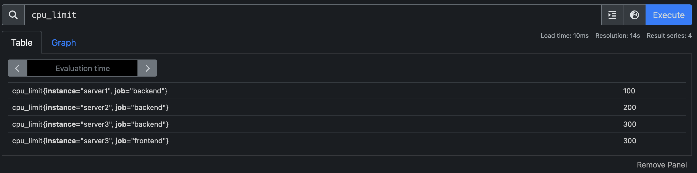

**使用 >= 操作符返回的示例结果（不带bool修饰符）**

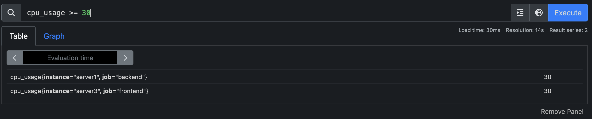

**使用 >= 返回的示例结果（带bool修饰符）**

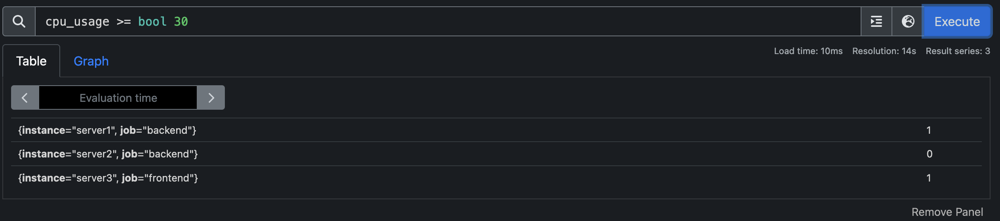

3. **瞬时向量和瞬时向量**：这些运算符默认作为一个过滤器，应用于匹配的条目。那些表达式不为真的向量元素，或者在表达式的另一侧找不到匹配的向量元素，将会从结果中删除，而其他的将会传播到结果向量中，分组标签变为输出标签集。如果提供了 bool 修饰符，那些原本会被删除的向量元素会被赋值为0，那些保留下来的向量元素会被赋值为1，分组标签再次变为输出标签集。**如果提供了 bool 修饰符，度量名称将会被删除**。

**示例数据依然采用上述的两组示例数据**

**使用 < 操作符的结果示例（不带bool修饰符）**

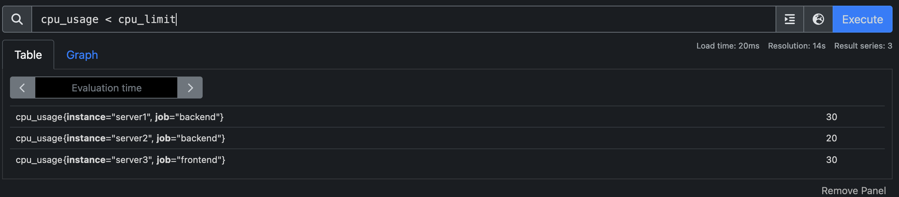

**使用 < 操作符的结果示例（带bool修饰符）**

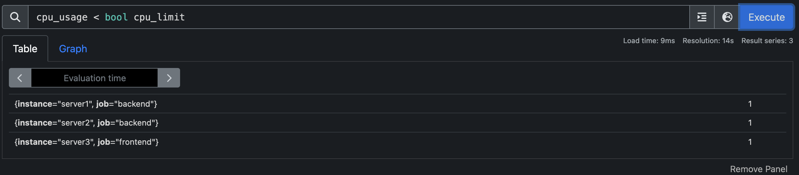

## 逻辑或集合二元操作符（Logical/set binary operators）

**这些逻辑/集合二元运算符仅在瞬时向量之间定义：**

* **and (交集)** 
* **or (并集)** 
* **unless (补集)**

**`vector1 and vector2` 的结果是一个由 vector1 的元素组成的向量，这些元素在 vector2 中有完全匹配的标签集。其他元素被丢弃。度量名称和值从左侧向量传递过来。**

**Note: 示例数据依然采用上面的示例数据**

**vector1 and vector2示例：**

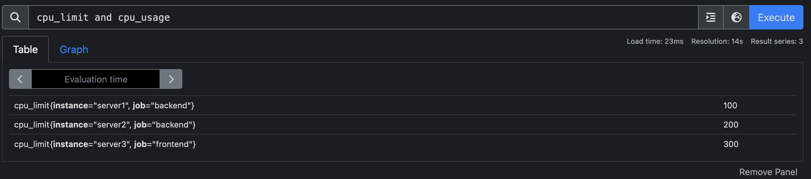

**`vector1 or vector2` 的结果是一个向量，它包含 vector1 的所有原始元素（标签集 + 值）以及在 vector1 中没有匹配标签集的 vector2 的所有元素。**

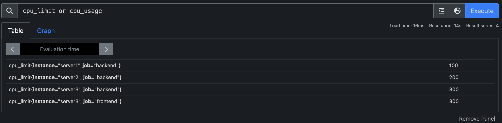

**`vector1 unless vector2` 的结果是一个由 vector1 的元素组成的向量，这些元素在 vector2 中没有完全匹配的标签集。两个向量中所有匹配的元素都被丢弃。**

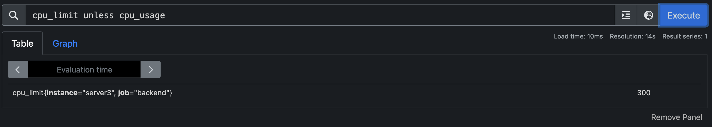

## 向量匹配

向量间的操作尝试为左侧向量的每个元素找到右侧向量中的匹配元素。有两种基本类型的匹配行为：一对一和多对一/一对多。

### 向量匹配关键字 

这些向量匹配关键字允许在具有不同标签集的序列之间进行匹配

* **on**
* **ignoring** 

提供给匹配关键字的标签列表将决定如何组合向量。在一对一向量匹配和多对一/一对多向量匹配中可以找到示例。

### 组修饰符 

这些组修饰符启用了多对一/一对多向量匹配：

* **group_left** 
* **group_right** 

可以向组修饰符提供包含要在结果度量中包含的 "一" 侧的标签的标签列表。

多对一和一对多匹配是需要仔细考虑的高级用例。通常，适当地使用**ignoring（<labels>）**可以提供期望的结果。

**分组修饰符只能用于比较和算术。默认情况下，and，unless和or操作与右向量中的所有可能条目匹配。**

### 一对一向量匹配 

一对一找到了操作的每一边的唯一一对条目。在默认情况下，即按照 vector1 <operator> vector2 的格式进行的操作。如果它们具有完全相同的标签集和相应的值，那么两个条目就匹配。**ignoring**关键字允许在匹配时忽略某些标签，而**on**关键字允许将考虑的标签集减少到提供的列表：

> <vector expr> <bin-op> ignoring(<label list>) <vector expr> <vector expr> <bin-op> on(<label list>) <vector expr>

**示例数据：**

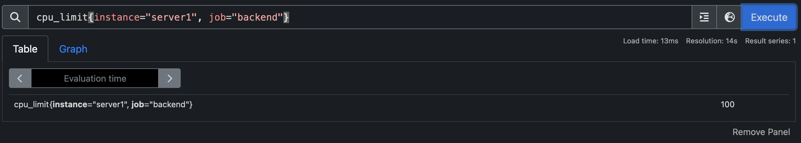

和


**在不使用ignoring或者on关键字时的演示结果：**

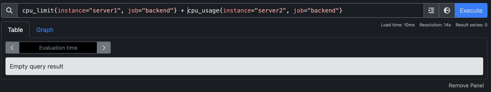

以上的结果可以发现对两个不匹配的向量进行算术运算时，结果为空。

**ignoring关键字使用的演示结果:**

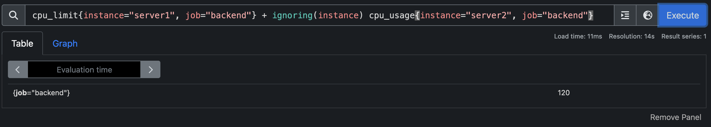

**在不使用ignoring的前提下，上面两个向量是不匹配的，因为其中一个标签无法匹配。当使用了ignoring来忽略不匹配的标签以后，运算符两侧的向量匹配。**

**on关键字使用的演示结果:**

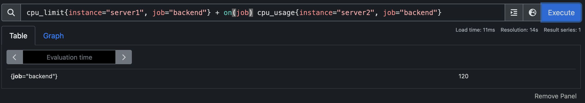

### 多对一和一对多向量匹配

 **多对一和一对多匹配指的是 "一" 侧的每个向量元素可以与 "多" 侧的多个元素匹配的情况。必须使用 group_left 或 group_right 修饰符明确请求这种情况，其中 left/right 决定哪个向量具有更高的基数。**

>```
><vector expr> <bin-op> ignoring(<label list>) group_left(<label list>) <vector expr>
><vector expr> <bin-op> ignoring(<label list>) group_right(<label list>) <vector expr>
><vector expr> <bin-op> on(<label list>) group_left(<label list>) <vector expr>
><vector expr> <bin-op> on(<label list>) group_right(<label list>) <vector expr>
>```

**附带组修饰符的标签列表包含来自 "一" 侧的要包含在结果度量中的附加标签。对于 on，标签只能出现在列表中的一个中。结果向量的每个时间序列必须能被唯一地标识。**

**一对一示例：**


等价于

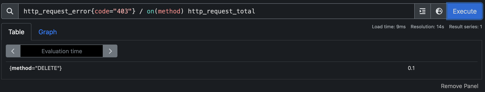

**一对一其实是特殊的一对多或者多对一，因此也能使用group_left和group_right**

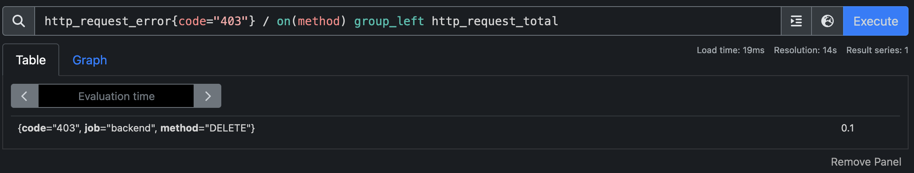

和

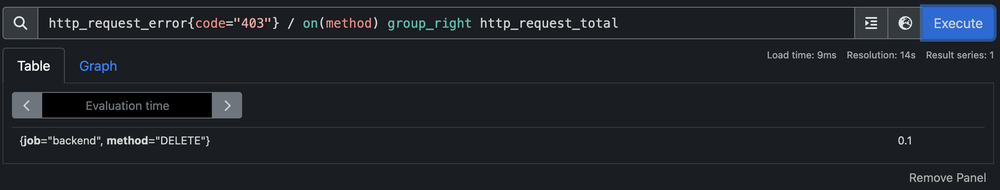

**多对一示例：**

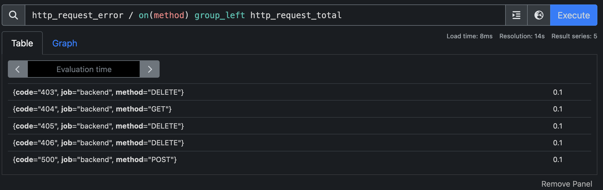

**一对多示例：**

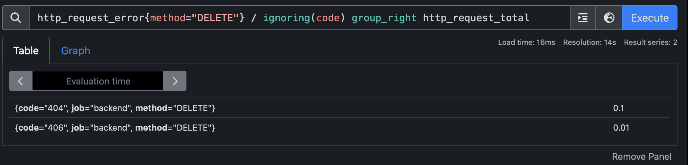

**Note: 需要注意的是，group_left和group_right用来决定返回的向量的标签以哪一侧为准。如果是left，返回的结果包含左侧向量匹配向量的标签集合。如果是right，则返回的结果包含右侧向量匹配的标签集合。 需要注意的是，返回的结果集中，每一个向量必须是唯一的，不允许出现相同重复的向量。**

## Prometheus聚合操作符

Prometheus提供了一系列内建的聚合操作符，可以用来对单个即时向量的元素进行聚合，从而产生一个新的、元素更少但已被聚合的向量：

- **sum：计算维度上的和**
- **min：在维度上选择最小值**
- **max：在维度上选择最大值**
- **avg：计算维度上的平均值**
- **group：生成的向量中所有的值都是1**
- **stddev：计算维度上的总体标准偏差**
- **stdvar：计算维度上的总体方差**
- **count：计算向量中元素的个数**
- **count_values：计算具有相同值的元素的个数**
- **bottomk：根据样本值选择最小的k个元素**
- **topk：根据样本值选择最大的k个元素**
- **quantile：计算维度上的φ-分位数（0 ≤ φ ≤ 1）**

**这些操作符可以用来聚合所有标签维度，或者通过包含一个 without 或 by 子句来保留不同的维度。这些子句可以在表达式前或后使用。**

```
<aggr-op> [without|by (<label list>)] ([parameter,] <vector expression>)
```

或

```
<aggr-op>([parameter,] <vector expression>) [without|by (<label list>)]
```

### sum聚合函数示例

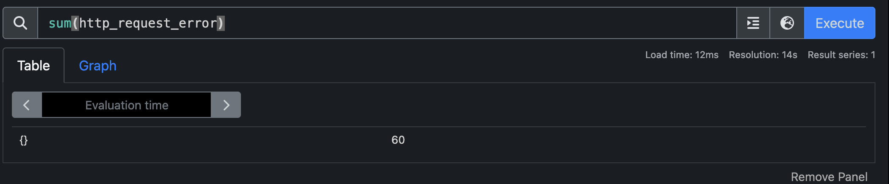

**如果对某一个向量使用sum聚合函数，则会返回该向量所有维度相加以后的总和**

**label list是一个未引用(这里的未引用的指的是没有被单引号或者双引号包围)的标签列表，可能包含尾部逗号，例如 (label1, label2) 和 (label1, label2,) 都是有效的语法。**

**without 从结果向量中移除列出的标签，而所有其他标签在输出中都被保留。而 by 则做相反的事情，它会丢弃不在 by 子句中列出的标签，即使它们的标签值在向量的所有元素之间都是相同的。**

### without子句使用示例

### 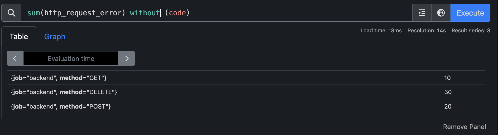

和

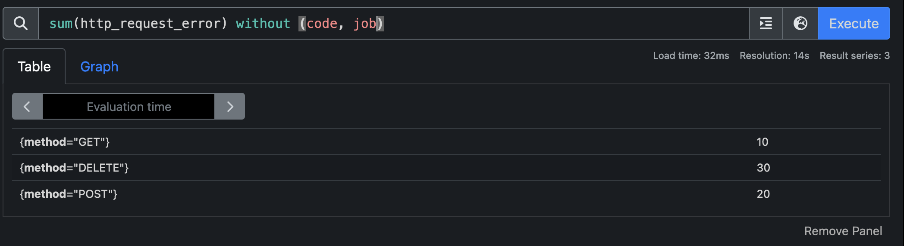

### by子句使用示例


和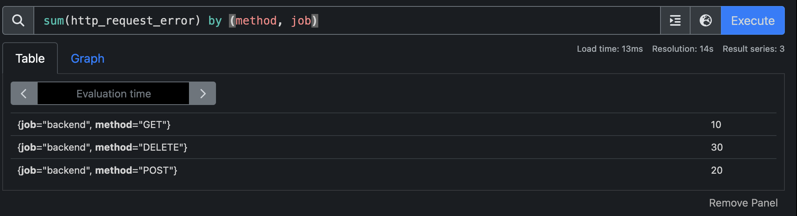

**从以上可以看出，使用without和by子句可以获得同样的结果集**

**参数仅在 count_values, quantile, topk 和 bottomk 中需要。**

**count_values** 输出每个唯一样本值的一个时间序列。每个序列都有一个额外的标签。该标签的名称由聚合参数给出，标签值是唯一的样本值。每个时间序列的值是该样本值出现的次数。

**示例数据，每一个向量的值对应一个http状态码，因此我们可以通过count_values聚合函数来统计每个状态码出现的次数：**

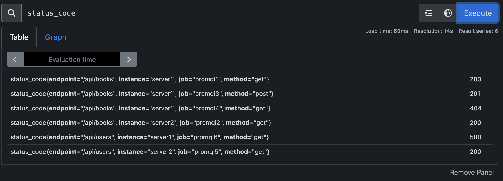

**使用函数以后返回的结果向量，统计出了每个状态码出现的次数，如果要进一步细分，也可以给status_code加上过滤标签。比如只统计endpoint="/api/books"的向量中各个状态出现的次数** 

**topk** 和 **bottomk** 与其他聚合器不同，因为结果向量返回的是输入样本的子集，包括原始的标签。**by** 和 **without** 仅用于对输入向量进行分桶。

**quantile** 计算 φ-分位数，即在聚合维度的 N 个度量值中排名为 φ*N 的值。φ 作为聚合参数提供。例如，quantile(0.5, ...) 计算中位数，quantile(0.95, ...) 计算95分位数。对于 φ = NaN，返回 NaN。对于 φ < 0，返回 -Inf。对于 φ > 1，返回 +Inf。

**topk示例：统计top 2的状态码出现的次数**

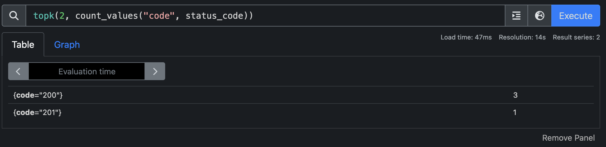

